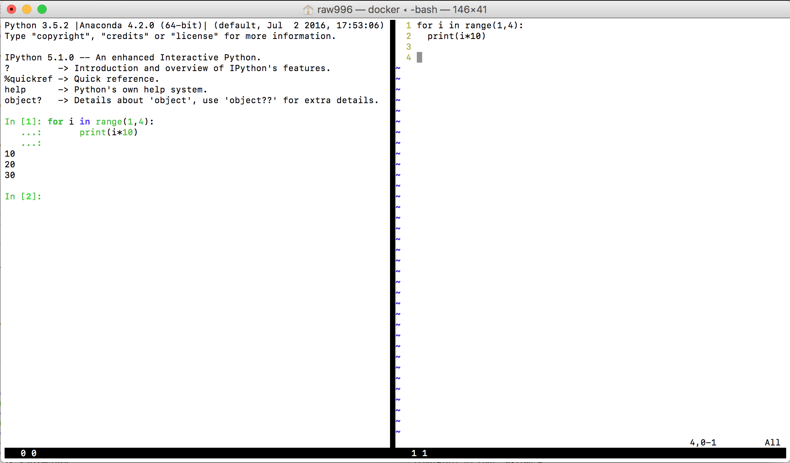

# Docker

## What is Docker, and why is it good?

http://blog.kaggle.com/2016/02/05/how-to-get-started-with-data-science-in-containers/

## What is REPL?

Read-eval-print loop. Basically, the user types (reads) stuff into an interactive terminal, the script is evaluated, and results printed. This loops over and over, until the script is finished.

Of course, if you type directly into the interactive terminal, your scripts are lost to eternity. Thus it is better to type your scripts into a text file and have them automatically copied into the interactive terminal. The most well-known example of this is [RStudio](http://www.rstudio.com).

## What is VIM?

"Vim is a highly configurable text editor built to make creating and changing any kind of text very efficient." <www.vim.org>

## What is vim-slime?

https://github.com/jpalardy/vim-slime

## Which Docker containers should I use?

https://github.com/rocker-org

https://github.com/Kaggle/docker-python

## Putting it all together

https://github.com/raubreywhite/docker

