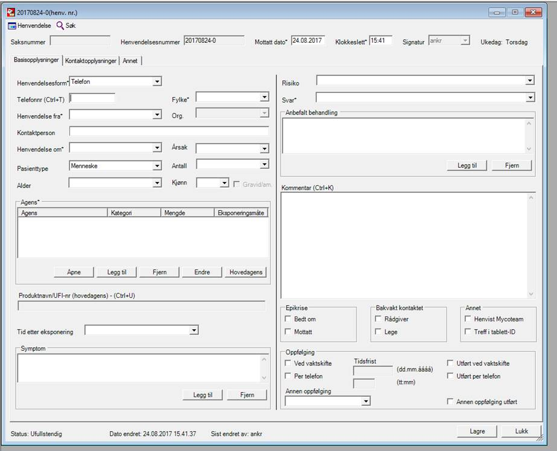

# Examples

## Poisons Information Center

Scenario:

- Approximately 40 000 calls per year
- The frequency of calls regarding different drugs/plants etc varies greatly, from a couple per year to thousands per year, so most probably one method will not cover everything.
- The registration of data is done while on the phone, and we know there are mistakes
- Only the field Kommentar has free text

Question: Is the number of calls regarding women aged 15-19 who have been exposed to paracetamol rising or falling over the years.

**Aim**: 

**Outcome**: 

**Exposure**: 

**Parametric assumptions**: 

**Dependencies**: 

## Norwegian Water Pipes

Scenario:

- 146 waterworks in 19 counties in Norway
- Each waterwork uses pipes to deliver water to households
- Information on each waterwork:
  * Length of pipes made out of asbestos (in meters)
  * Length of pipes made out of iron/steel (in meters)
  * Length of pipes made out of PVC (in meters)
  * Length of pipes made out of PE/PEH (in meters)
  * Length of pipes made out of other (in meters)
  * Length of pipes made out of unknown (in meters)
  * Length of pipes installed before 1910 (in meters)
  * Length of pipes installed in 1910-1940 (in meters)
  * Length of pipes installed in 1941-1970 (in meters)
  * Length of pipes installed in 1971-2000 (in meters)
  * Length of pipes installed after 2000 (in meters)
  * Length of pipes installed during an unknown period (in meters)
- Each year, some new pipes are laid to extend the network
- Each year, some pipes are replaced
- Interruption in water delivery is estimated in hours per calendar year
- Data is only for 2015

Question: Is there an association between "interuption in water delivery" and "type of pipe material" and "pipe installation period"

**Aim**: 

**Outcome**: 

**Exposure**: 

**Parametric assumptions**: 

**Dependencies**: 

