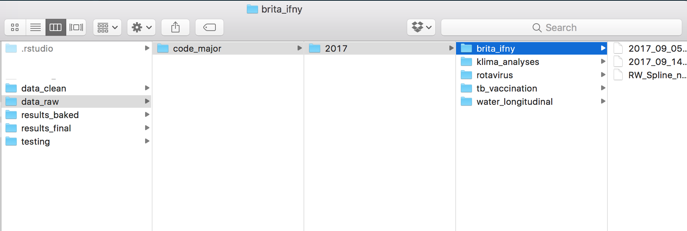
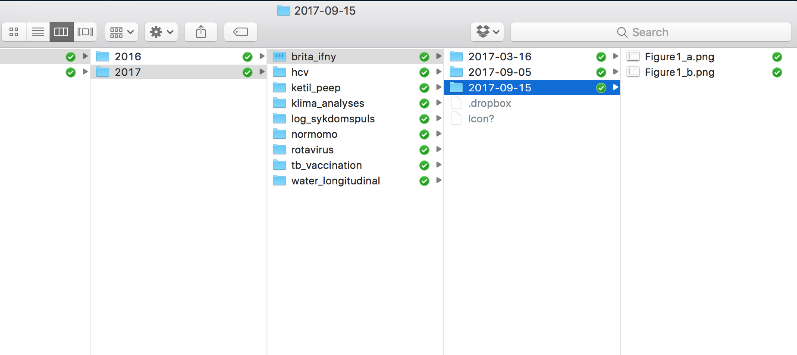
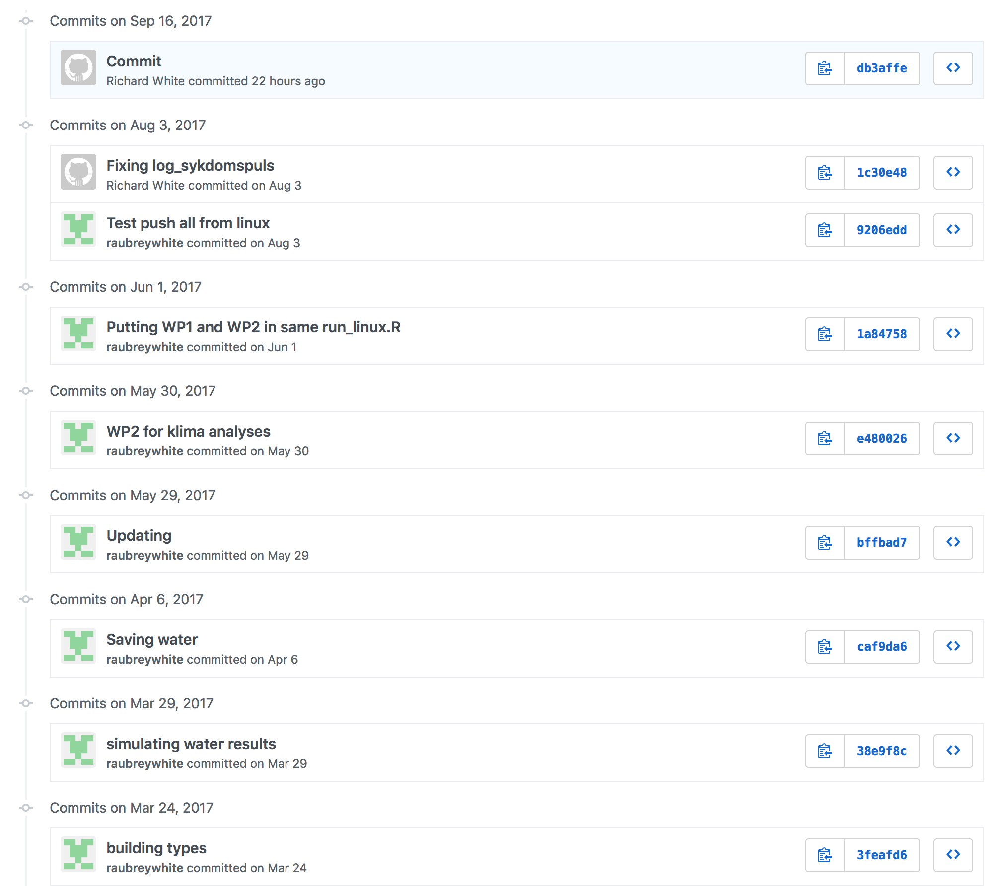
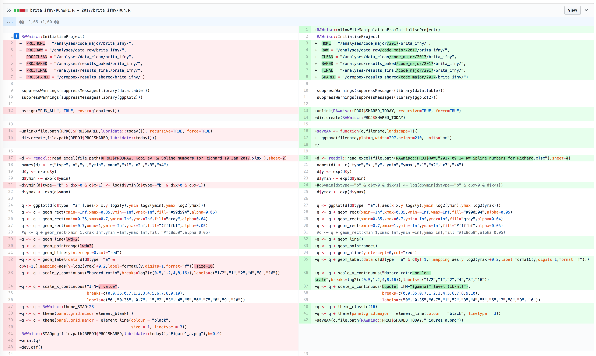
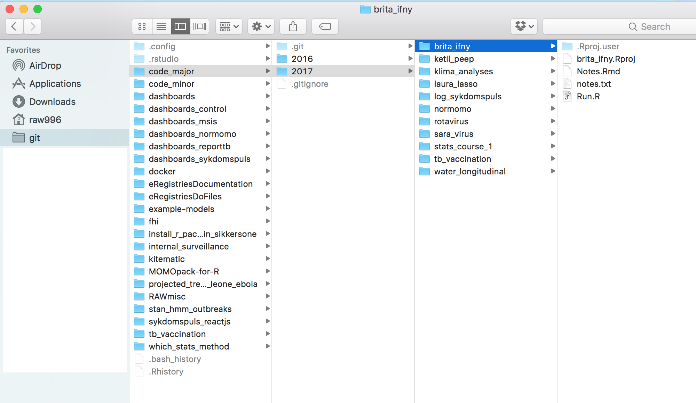

# Good folder structure

## Data and results

- One folder for raw data
- One folder for temporary data (if needed)
- One folder for clean data

- One folder for shared results (dropbox)
- Every time you run your analyses, you should store your new results in a new day's folder, allowing you to always access your previous results
- Labelling by date (year-month-day) is a lot more intuitive than "results_1", "results_2", "results_final", "results_final_final"
- Label in the format 2017-09-01 so that your computer can easily sort the results (the padding/leading 0s are important for sorting!)
- Do not label folders using the format 2017-SEP-1 (it doesn't sort well)
- Do not label folders using the format 1-SEP-17 (it doesn't sort well)

## Keep your source code separate from data

Source code is:

- Not sensitive
- Very easy to accidentally delete and/or overwrite

This means it is perfect to be uploaded to http://github.com where you can store every version of your code, and never have to worry about losing an old copy

You can also see the differences between your versions:

It is best to keep each project in it's own folder. Within each folder, there should be a masterfile ("Run") that will perform all of the necessary tasks in the entire analysis:

- Clean data
- Run analyses

Do files/scripts should be numbered:

- 0_run_all.do
- 1_clean_lab_data.do
- 2_clean_lifestyle_data.do
- 3_merge_lab_lifestyle_data.do
- 4_descriptive_analyses.do
- 5_regression_analyses.do

It is very very very important that analysis files only use the "clean" data (from the clean data folder), and perform ZERO changes to the data. All necessary changes and/or variable creations must be done in the data cleaning do files.

